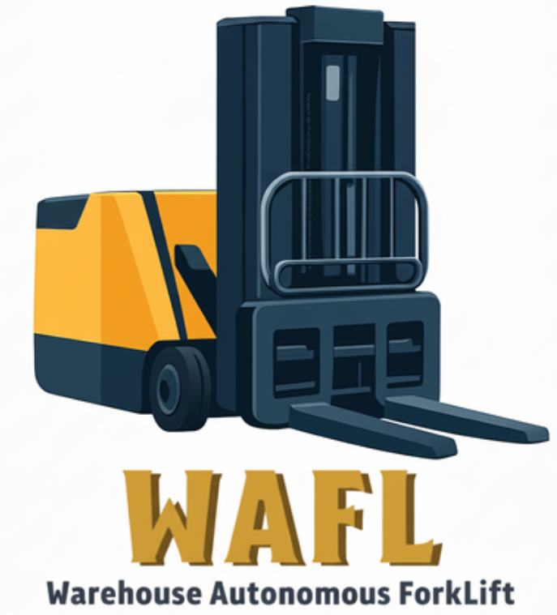

  

# WAFL_2025

A repository made for the WAFL graduation project 2025/2026.

---

## About

The Autonomous Forklift Project (WAFL 2026) is a
cutting-edge graduation project from the Mechatronics
Department, Ain Shams University. Our goal is to design
and build an intelligent, fully autonomous forklift that
will revolutionize warehouse automation by improving
safety, efficiency, and cost-effectiveness.

## Project Structure

WAFL_2025/
├─ README.md
├─ src/
├─ docs/
├─ hardware/

## Team

- Ahmed Elsafty
- Ahmed Ashraf
- Amr Khaled
- Marina Alber
- Malaak Mikhael
- Mohamed Montasser
- Omar Emad

